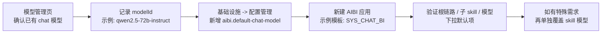

# AIBI默认模型全局配置｜上线后配置与测试手册

## 1. 文档目的

本文面向上线实施、运维和现场测试同学，用于指导 AIBI 默认模型全局配置项的配置与验证。

本文只回答三件事：

1. 应该在什么地方找“可直接拿来用”的模型标识
2. 应该在什么地方配置 `aibi.default-chat-model`
3. 配完以后，怎样验证新建 AIBI 应用确实已经吃到这个默认模型

本文是现场操作手册，不展开研发实现细节。研发实现以当前上线包与代码为准。

## 2. 能力说明

本次新增的全局系统配置项为：

```text
aibi.default-chat-model
```

AIBI 运行时取默认模型的优先级如下：

1. skill 自己单独保存的 `model`
2. 全局系统配置 `aibi.default-chat-model`
3. 旧逻辑中的历史兜底默认值

这意味着：

1. 配了全局默认模型后，新建应用、新增链路组件、技能详情页和模型下拉默认项都会按这套逻辑显示
2. 某个 skill 后续仍然可以单独改模型，单独改过后以 skill 自己的模型为准
3. 该配置是全局配置，不是租户级配置

## 3. 端到端操作总览



## 4. 使用前提

执行前请先确认：

1. `cloud` 已启动且健康检查正常
2. 可以登录 `admin-ui`
3. 如果准备把默认值配成“模型管理里的模型”，那么目标租户下必须已经存在一个可用的 `chat` 模型

说明：

1. `aibi.default-chat-model` 既支持内置模型枚举，也支持模型管理中的 `modelId`
2. 如果想解决“新租户一开始没有任何模型管理记录，导致无法创建智能体”的问题，优先建议先配内置模型
3. 如果现场已经统一接好外部模型，也可以直接配模型管理里的 `modelId`

## 5. 本文示例使用的现成模型

本文示例不使用手填模型名，而是直接使用本地环境模型管理中已经存在的一条 `chat` 模型记录。

本地实测时，模型管理页可用示例如下：

| 字段 | 示例值 |
| --- | --- |
| 模型名称 | `72B` |
| 模型标识 `modelId` | `qwen2.5-72b-instruct` |
| 提供商 | `qwen` |
| 模型类型 | `chat` |

关键点：

1. 配置项里要填的是 `modelId`
2. 不要填“模型名称”
3. 不要填“页面展示名”

也就是说，本例真正要填入配置中心的值是：

```text
qwen2.5-72b-instruct
```

不是：

```text
72B
```

## 6. 配置手册

### 6.1 第一步：在模型管理页找到可用的 `modelId`

进入 `admin-ui` 的模型管理页面，筛选 `chat` 类型模型。

建议现场按下面的口径找值：

1. 先找一个已经确认可用的 `chat` 模型
2. 看清楚它的“模型名称”和“模型标识 `modelId`”不是一回事
3. 记录 `modelId`，后面配置中心填的就是它

本地示例：

| 页面上看到的名称 | 实际要记录的值 |
| --- | --- |
| `72B` | `qwen2.5-72b-instruct` |

判读规则：

1. 页面上如果只记了“72B”，这是不够的
2. 必须拿到 `qwen2.5-72b-instruct` 这种稳定标识
3. 后续如果模型管理里把这个 `modelId` 改了，那么系统配置也必须同步改

### 6.2 第二步：在配置管理中新增全局默认模型配置

进入：

```text
admin-ui -> 基础设施 -> 配置管理
```

新增一条系统配置，按下表填写：

| 配置项 | 示例值 |
| --- | --- |
| 参数分类 | `aibi` |
| 参数名称 | `AIBI默认聊天模型` |
| 参数键名 | `aibi.default-chat-model` |
| 参数键值 | `qwen2.5-72b-instruct` |
| 是否可见 | `是` |
| 备注 | `AIBI未单独指定skill模型时使用的全局默认模型` |

保存后，配置项效果等价于：

```text
aibi.default-chat-model = qwen2.5-72b-instruct
```

这一节最容易出错的地方有两个：

1. 键名必须是 `aibi.default-chat-model`
2. 键值必须是 `modelId`，不能填 `72B`

### 6.3 第三步：新建一个 AIBI 应用做验证

完成配置后，新建一个 AIBI 应用验证默认模型是否真的生效。

建议选用：

```text
SYS_CHAT_BI
```

验证时重点看三处：

1. 根链路默认模型
2. 子 skill 默认模型
3. skill 模型下拉中的默认项

说明：

1. 创建应用时不需要额外手填默认模型
2. 只要该链路和 skill 没有单独保存 `model`，就会走 `aibi.default-chat-model`
3. 后续如有特殊需求，仍然可以对某个 skill 单独改模型

## 7. 页面验证口径

### 7.1 验证根链路

新建应用后，先看根链路。

预期结果：

1. 根链路展示模型应为 `qwen2.5-72b-instruct`
2. 如果页面显示的是模型名称而不是标识，也应能对应到这条模型

### 7.2 验证子 skill

再看链路下的子 skill。

以 `SYS_CHAT_BI` 为例，至少关注这几个系统 skill：

1. `SYS_CHAT_BI_TABLE_ROUTE`
2. `SYS_CHAT_BI_VALUE_CORRECTION`
3. `SYS_CHAT_BI_REWRITING`

预期结果：

1. 这些 skill 的模型默认值都应为 `qwen2.5-72b-instruct`
2. 技能详情页里看到的模型值，也应与全局默认值一致

### 7.3 验证模型下拉默认项

再进入任一 skill 的模型选择下拉。

预期结果：

1. `qwen2.5-72b-instruct` 对应项会被标记为默认项
2. 如果页面展示的是模型名称，则该项展示名称应为 `72B`
3. 但真正生效的底层标识仍然是 `qwen2.5-72b-instruct`

## 8. 本地端到端实测记录

以下结果为本地 `cloud` 启动后的实际复测结论，可作为现场判读参考。

本次复测使用：

```text
aibi.default-chat-model = qwen2.5-72b-instruct
```

复测链路如下：

1. 在模型管理中确认已存在 `chat` 模型：`72B / qwen2.5-72b-instruct`
2. 在配置管理中新增 `aibi.default-chat-model`
3. 新建一个 `SYS_CHAT_BI` 应用
4. 查看根链路、子 skill、技能详情和模型下拉默认项

本地复测结果：

1. 根链路 `SYS_CHAT_BI` 返回的模型值为 `qwen2.5-72b-instruct`
2. 子 skill `SYS_CHAT_BI_TABLE_ROUTE`、`SYS_CHAT_BI_VALUE_CORRECTION`、`SYS_CHAT_BI_REWRITING` 返回的模型值均为 `qwen2.5-72b-instruct`
3. 技能详情接口返回的模型值为 `qwen2.5-72b-instruct`
4. 技能模型下拉枚举中，`qwen2.5-72b-instruct` 被标记为默认项

这说明：

1. 配置中心值已经被新建应用吃到
2. 根链路和子 skill 的默认模型展示是一致的
3. 下拉默认项与实际运行解析逻辑是一致的

## 9. 关于“真正问答是否走到这个模型”的判读

如果你是用一个刚创建、还没有绑定数据集的 `SYS_CHAT_BI` 应用去直接提问，可能会在业务前置校验阶段失败。

本地实测中，空应用提问会先报：

```text
无有效的数据集
```

这不是默认模型配置没生效，而是应用还没具备执行问答的业务前提。

因此现场判读时请区分两件事：

1. 默认模型是否生效  
   看根链路、子 skill、技能详情、模型下拉默认项即可判断
2. 实际问答是否成功  
   还取决于数据集、权限和其他业务前提是否完整

如果要验证“真实问答最终也按这个模型执行”，请使用：

1. 已绑定数据集的现有 AIBI 应用
2. 或先把新建应用的数据集配置补齐后再测

## 10. 回滚手册

如果现场需要快速回滚，建议按下面两种方式处理。

### 10.1 回切到内置模型

把配置改成一个稳定可用的内置模型枚举，例如：

```text
aibi.default-chat-model = QWEN_3_235B
```

适用场景：

1. 外部模型暂时不稳定
2. 各租户并没有统一配置同名 `modelId`

### 10.2 删除全局默认模型配置

如果希望彻底回退到旧逻辑，可直接删除：

```text
aibi.default-chat-model
```

回滚后效果：

1. 系统回退到旧的历史兜底默认逻辑
2. 已经单独保存过 `model` 的 skill 不受影响

## 11. 常见问题

### 11.1 为什么配置项里不能填 `72B`

因为 `72B` 是页面展示名，不是稳定标识。

配置中心真正需要的是：

```text
qwen2.5-72b-instruct
```

### 11.2 模型管理里的 `modelId` 后续能改吗

可以改，但改了以后要同步改：

```text
aibi.default-chat-model
```

原因是系统配置里保存的就是这个标识，不会自动跟着展示名变化。

### 11.3 配成模型管理里的 `modelId` 后，为什么有的租户还是跑不起来

因为 `aibi.default-chat-model` 是全局配置，不带租户维度。

如果你配的是模型管理里的 `modelId`，那所有会命中这个默认值的租户，都必须有同名的 `chat` 模型配置。

### 11.4 后续还能不能单独改某个 skill 的模型

可以。

规则仍然是：

1. skill 单独保存了模型，就优先用 skill 自己的模型
2. 只有没单独保存模型的 skill，才走 `aibi.default-chat-model`

## 12. 最小必测清单

上线后至少执行以下 4 项：

1. 在模型管理页确认现场准备填入的确实是 `modelId`，不是展示名
2. 在配置中心新增 `aibi.default-chat-model` 后，确认保存成功
3. 新建一个 `SYS_CHAT_BI` 应用，确认根链路和子 skill 默认模型都已变成配置值
4. 打开任一 skill 的模型下拉，确认该模型已被标记为默认项
