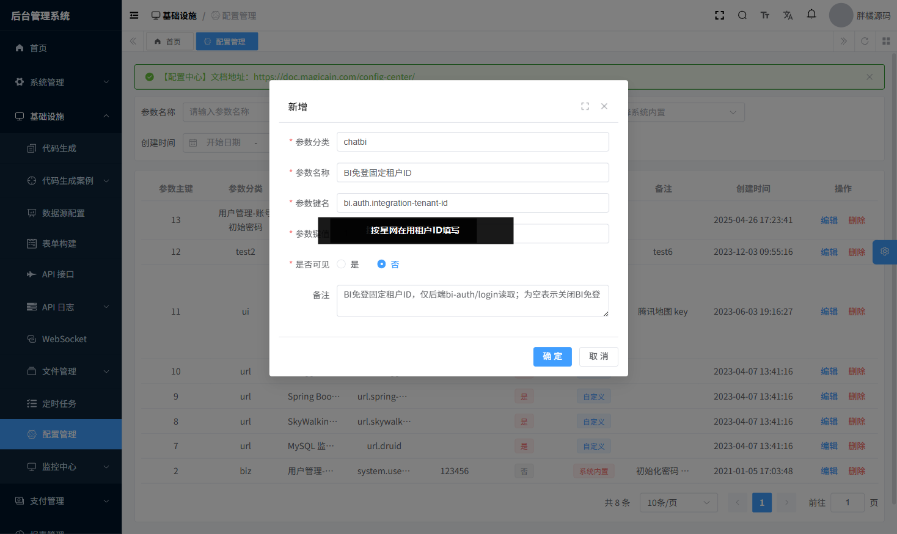
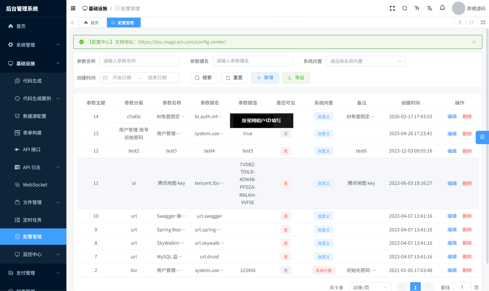
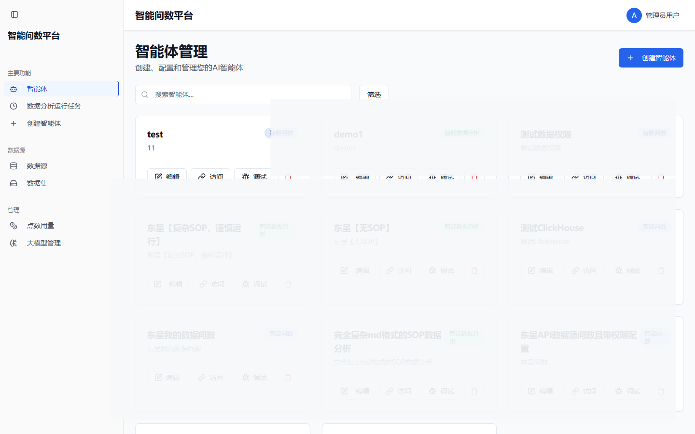
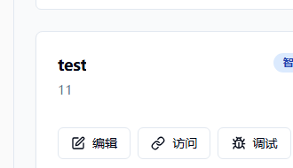

# ChatBI Agent端免登与用户端跳转｜上线后配置与测试手册

## 1. 文档目的

本文面向前线实施、运维和现场测试工程师，用于指导以下两项能力的上线后配置与验证：

1. BI 侧跳转 `agent-ui` 的免登能力
2. 登录 `agent-ui` 后，通过目标 Agent 卡片上的按钮跳转到用户端 `/c/` 的能力

本文是现场执行手册，不展开研发实现细节。研发与实现以当前代码和上线包为准。

## 2. 适用范围

适用于本次星网整合集成的以下部署形态：

1. Agent 管理前端 `agent-ui` 已部署到 `/agent/`
2. 用户前端 `user-ui` 已部署到 `/c/`
3. 后端已部署并接入同源网关 `/admin-api`
4. BI 侧将通过浏览器跳转方式进入 Agent 管理端
5. Agent 管理端中的“访问 / 调试”按钮，将继续跳转到用户端 `/c/`

## 3. 上线前准备

现场执行前，请先确认以下信息已经拿齐：

1. ChatBI 访问域名  
   示例：`https://chatbi.magicain.com`
2. BI 侧测试用户的 `externalUserId`
3. 后端固定租户编号，用于配置 `bi.auth.integration-tenant-id`
4. Agent 默认角色编号，用于配置 `bi.auth.default-agent-role-id`
5. `admin-ui` 可登录账号，且具备“基础设施 -> 配置管理”维护权限
6. 至少选定一个用于演示和测试的目标 Agent，并确认其 `appId` 与类型
7. 若 BI 侧尚未上线，现场可直接手工构造 `/agent/bi-entry.html?...` 测试地址代替 BI 菜单入口

### 3.1 先判断是“完整重新配置”还是“基于用户端既有配置做增量”

本次 Agent 端手册需要和之前的用户端手册区分执行口径。

1. 完整重新配置  
   适用于之前没有做过用户端免登配置，或者现场环境是首次落地。  
   需要同时完成：
   1. `bi.auth.integration-tenant-id`
   2. `bi.auth.default-agent-role-id`
   3. Agent 端入口 `/agent/bi-entry.html`
2. 基于用户端既有配置做增量  
   适用于之前已经按《ChatBI BI免登与图表推送｜上线后配置与测试手册》完成过用户端免登。  
   这时通常：
   1. `bi.auth.integration-tenant-id` 已存在，不需要重复新建
   2. 本次只需要复核该租户配置仍然正确
   3. 新增 `bi.auth.default-agent-role-id`
   4. 部署 Agent 端桥接页与对应后端版本

建议现场优先按“增量配置”理解。只有确认之前没有用户端免登配置时，才走“完整重新配置”。

### 3.2 开头先执行的SQL

如果之前已经做过用户端免登，建议先执行下面两组 SQL，再决定本次是否只做增量。

先查当前已经配置的固定租户：

```sql
select config_key, value
from infra_config
where deleted = 0
  and config_key = 'bi.auth.integration-tenant-id';
```

判读方式：

1. 查得到值：说明用户端免登的固定租户配置已经存在，本次优先按“增量配置”执行
2. 查不到值：说明现场还没做过固定租户配置，本次要按“完整重新配置”执行

再查该租户下哪些角色覆盖了 Agent 端需要的权限：

```sql
select
    r.id,
    r.name,
    r.code,
    count(distinct m.permission) as matched_permission_count,
    string_agg(distinct m.permission, ', ' order by m.permission) as matched_permissions
from system_role r
join system_role_menu rm
  on rm.role_id = r.id
 and rm.deleted = 0
join system_menu m
  on m.id = rm.menu_id
 and m.deleted = 0
where r.deleted = 0
  and r.status = 0
  and r.tenant_id = (
    select cast(value as bigint)
    from infra_config
    where deleted = 0
      and config_key = 'bi.auth.integration-tenant-id'
    limit 1
  )
  and m.permission in ('aibi:agent:admin', 'dataagent:agent:admin')
group by r.id, r.name, r.code
order by count(distinct m.permission) desc, r.id;
```

判读方式：

1. `matched_permission_count = 2`  
   说明该角色同时覆盖：
   1. `aibi:agent:admin`
   2. `dataagent:agent:admin`  
   这类角色可以优先作为 `bi.auth.default-agent-role-id`
2. 如果只有 `1`  
   说明该角色只覆盖一种 Agent 权限，不适合直接作为通用默认角色
3. 如果查不到满足要求的角色  
   说明需要先新建一个组合角色，再把该新角色的 `id` 配到 `bi.auth.default-agent-role-id`

## 4. 上线内容清单

### 4.1 后端能力

1. 复用 BI 免登登录接口：`POST /system/bi-auth/login`
2. 已在配置中心维护固定租户参数：`bi.auth.integration-tenant-id`
3. 已在配置中心维护 Agent 默认角色参数：`bi.auth.default-agent-role-id`
4. 免登用户若尚无内部账号，可自动创建影子账号
5. 免登用户若尚无目标 Agent 角色，可自动补充 `bi.auth.default-agent-role-id` 指向的角色

说明：

1. 浏览器侧实际调用通常走同源网关地址：`/admin-api/system/bi-auth/login`
2. 若 `bi.auth.integration-tenant-id` 未配置，免登不可用
3. 若 `bi.auth.default-agent-role-id` 未配置，免登仍可成功，但可能因缺少 Agent 权限而无法进入管理页

### 4.2 前端能力

1. `agent-ui/public/bi-entry.html` 已随前端一并发布
2. `bi-entry.html` 可读取 `externalUserId`
3. `bi-entry.html` 可写入本地缓存：
   1. `ACCESS_TOKEN`
   2. `REFRESH_TOKEN`
   3. `tenantId`
   4. `biExternalUserId`
4. `bi-entry.html` 默认跳转到 `/agent/`
5. Agent 管理页中，每个 Agent 卡片可显示“访问 / 调试”按钮

### 4.3 Agent卡片跳转能力

当前按钮逻辑如下：

1. ChatBI Agent
   1. 正常模式：`/c?appId=<appId>`
   2. 调试模式：`/c?appId=<appId>&debug=true`
2. Data Agent
   1. 正常模式：`/c?appId=<appId>&isDataAgent=true`
   2. 调试模式：`/c?appId=<appId>&isDataAgent=true&debug=true`

## 5. 配置手册

### 5.1 执行路径选择

请先按第 `3.2` 节 SQL 查实现场状态，再按下列路径执行：

1. 完整重新配置  
   适用条件：之前未做过用户端免登，或 `bi.auth.integration-tenant-id` 查不到  
   执行范围：`5.2` + `5.3` + `5.4`
2. 基于用户端既有配置做增量  
   适用条件：之前已经做过用户端免登，且 `bi.auth.integration-tenant-id` 已存在  
   执行范围：重点执行 `5.3` + `5.4`  
   其中 `5.2` 只需要复核，不需要重复新建

### 5.2 固定租户配置

进入：

`admin-ui -> 基础设施 -> 配置管理`

新增或确认如下配置：

1. 参数分类：`chatbi`
2. 参数名称：`BI免登固定租户ID`
3. 参数键名：`bi.auth.integration-tenant-id`
4. 参数键值：`目标现场固定租户ID`
5. 是否可见：`否`
6. 备注：`BI免登固定租户ID，仅后端bi-auth/login读取`

说明：

1. 该值必须与“星网当前在用租户”以及“目标 Agent 创建所在租户”一致
2. 不需要 BI 或前端额外传 `tenantId`
3. 若该配置不存在，Agent 端免登视为关闭

实操截图（沿用用户端免登同一配置项）：





### 5.3 Agent默认角色配置

进入：

`admin-ui -> 基础设施 -> 配置管理`

新增一条后端内部配置，填写如下：

1. 参数分类：`chatbi`
2. 参数名称：`BI免登默认Agent角色ID`
3. 参数键名：`bi.auth.default-agent-role-id`
4. 参数键值：`目标 Agent 角色ID`
5. 是否可见：`否`
6. 备注：`BI免登默认补充的Agent角色ID；为空表示不自动补角色`

角色选择要求：

1. 该角色必须属于 `bi.auth.integration-tenant-id` 指向的同一租户
2. 该角色必须处于启用状态
3. 推荐该角色同时包含以下权限：
   1. `aibi:agent:admin`
   2. `dataagent:agent:admin`
4. 若现场只需要某一类 Agent，也至少要包含对应的 `admin` 权限

说明：

1. 该配置由后端在 `bi-auth/login` 过程中读取
2. 免登用户若已有该角色，不会重复绑定
3. 免登用户若没有该角色，会以并集方式补上，不会覆盖用户原有角色

### 5.4 Agent端入口地址配置

BI 侧跳转 Agent 管理端的地址模板应为：

```text
https://chatbi.magicain.com/agent/bi-entry.html?externalUserId=<externalUserId>
```

推荐带上显式跳转参数：

```text
https://chatbi.magicain.com/agent/bi-entry.html?externalUserId=<externalUserId>&redirect=/agent/
```

说明：

1. `externalUserId` 必须是 BI 前置单点登录记录下来的真实外部用户标识
2. 不需要 BI 额外传 `tenantId`
3. 不需要 BI 传签名、时间戳、ticket
4. `redirect` 为可选参数；不传时默认进入 `/agent/`

## 6. 测试手册

### 6.1 自测一：手工构造 Agent 免登入口

操作步骤：

1. 清理当前浏览器中 ChatBI 相关登录态
2. 在浏览器地址栏直接打开：

```text
https://chatbi.magicain.com/agent/bi-entry.html?externalUserId=<externalUserId>
```

预期结果：

1. 页面自动调用 `/admin-api/system/bi-auth/login`
2. 页面自动跳转到 `/agent/`
3. 不进入 `/admin/login`

### 6.2 自测二：验证 Agent 管理页可见

操作步骤：

1. 使用上一步免登方式进入 Agent 管理端
2. 等待页面加载完成

预期结果：

1. 页面显示“智能体管理”
2. 左侧菜单可见
3. 至少能看到目标 Agent 卡片

示意截图：

说明：文档截图中只保留一个目标 Agent，其它 Agent 卡片必须打码处理。



### 6.3 自测三：验证目标 Agent 的“访问 / 调试”按钮

操作步骤：

1. 在 Agent 管理页定位到目标 Agent
2. 确认该卡片显示“访问”和“调试”按钮

预期结果：

1. 目标 Agent 卡片上能看到“访问”按钮
2. 目标 Agent 卡片上能看到“调试”按钮
3. 其它 Agent 如非本次演示对象，截图中必须打码

示意截图：



### 6.4 自测四：验证跳转用户端正常模式

操作步骤：

1. 登录 Agent 管理端
2. 在目标 Agent 卡片上点击“访问”

预期结果：

1. 新标签页跳转到用户端 `/c/`
2. ChatBI Agent 打开地址应类似：

```text
/c?appId=<appId>
```

3. Data Agent 打开地址应类似：

```text
/c?appId=<appId>&isDataAgent=true
```

### 6.5 自测五：验证跳转用户端调试模式

操作步骤：

1. 登录 Agent 管理端
2. 在目标 Agent 卡片上点击“调试”

预期结果：

1. 新标签页跳转到用户端 `/c/`
2. ChatBI Agent 打开地址应类似：

```text
/c?appId=<appId>&debug=true
```

3. Data Agent 打开地址应类似：

```text
/c?appId=<appId>&isDataAgent=true&debug=true
```

### 6.6 自测六：验证新外部用户自动创建与补角色

操作步骤：

1. 选取一个从未使用过的 `externalUserId`
2. 手工打开 `/agent/bi-entry.html?externalUserId=...`
3. 登录成功后，回数据库检查映射与角色

预期结果：

1. `system_source_identity_mapping` 中新增一条 `BI_SYSTEM + externalUserId` 映射
2. 若此前无内部账号，应自动创建影子用户
3. `system_user_role` 中应出现 `bi.auth.default-agent-role-id` 指向的角色绑定

## 7. BI侧已上线后的联调与冒烟测试

建议在 BI 侧正式入口上线后，再执行以下联调与冒烟测试。

### 7.1 冒烟一：BI 入口跳转 Agent 管理端

操作步骤：

1. 清理当前浏览器中 ChatBI 相关登录态
2. 在 BI 侧点击跳转 Agent 管理端入口
3. 浏览器打开 `/agent/bi-entry.html?...`
4. 等待页面自动跳转到 `/agent/`

预期结果：

1. 不进入 `/admin/login`
2. 可直接进入 Agent 管理页
3. 当前登录身份与 BI 跳转用户一致

若现场允许使用浏览器开发者工具，可额外检查：

1. 网络中出现 `POST /admin-api/system/bi-auth/login`
2. 本地缓存中存在：
   1. `ACCESS_TOKEN`
   2. `REFRESH_TOKEN`
   3. `tenantId`
   4. `biExternalUserId`

### 7.2 冒烟二：目标Agent卡片可见且按钮完整

操作步骤：

1. 使用 BI 入口免登进入 Agent 管理端
2. 搜索并定位目标 Agent
3. 检查该卡片上的操作按钮

预期结果：

1. 目标 Agent 卡片可见
2. 卡片上存在“编辑 / 访问 / 调试”按钮
3. 若该 Agent 为 ChatBI Agent，则“访问 / 调试”跳转到 `/c?appId=...`
4. 若该 Agent 为 Data Agent，则“访问 / 调试”跳转到 `/c?appId=...&isDataAgent=true`

### 7.3 冒烟三：访问按钮跳转用户端正常模式

操作步骤：

1. 在目标 Agent 卡片上点击“访问”
2. 观察新标签页地址与页面结果

预期结果：

1. 新标签页跳转到用户端 `/c/`
2. ChatBI Agent 正常模式地址类似：

```text
/c?appId=<appId>
```

3. Data Agent 正常模式地址类似：

```text
/c?appId=<appId>&isDataAgent=true
```

### 7.4 冒烟四：调试按钮跳转用户端Debug模式

操作步骤：

1. 在目标 Agent 卡片上点击“调试”
2. 观察新标签页地址与页面结果

预期结果：

1. 新标签页跳转到用户端 `/c/`
2. ChatBI Agent 调试模式地址类似：

```text
/c?appId=<appId>&debug=true
```

3. Data Agent 调试模式地址类似：

```text
/c?appId=<appId>&isDataAgent=true&debug=true
```

## 8. 现场截图与脱敏要求

为避免在交付手册中暴露无关 Agent 信息，截图请遵守以下规则：

1. 只保留一个目标 Agent 作为演示对象
2. 其它 Agent 卡片必须整体打码，至少覆盖名称、描述、按钮区域
3. 若目标 Agent 名称本身敏感，也应对名称进行脱敏后再出图
4. 若截图中包含租户ID、角色ID、外部用户标识等敏感值，也必须打码

## 9. 最小必要测试用例（去重版）

现场至少执行以下 5 项：

1. 手工打开 `/agent/bi-entry.html?externalUserId=...`，确认免登成功
2. 确认进入 `/agent/` 后能看到目标 Agent
3. 确认目标 Agent 卡片上存在“访问 / 调试”按钮
4. 点击“访问”，确认能跳到用户端正常模式
5. 点击“调试”，确认能跳到用户端 Debug 模式

若现场还要验证新用户开通链路，则额外执行：

6. 用全新的 `externalUserId` 验证自动创建与自动补角色

## 10. 常见问题 / 排查口径

### 10.1 从 BI 跳转后进入登录页

优先检查：

1. BI 跳转地址是否使用 `/agent/bi-entry.html`
2. `externalUserId` 是否实际传入且不为空
3. `/admin-api/system/bi-auth/login` 是否已部署
4. 配置中心中的 `bi.auth.integration-tenant-id` 是否已配置
5. `bi.auth.integration-tenant-id` 是否与目标 Agent 所在租户一致
6. 浏览器 Network 中 `POST /admin-api/system/bi-auth/login` 的状态码和返回体是什么

### 10.2 能免登成功，但进入 Agent 管理页后空白或无权限

优先检查：

1. `bi.auth.default-agent-role-id` 是否已配置
2. 该角色是否属于 `bi.auth.integration-tenant-id` 指向的租户
3. 该角色是否为启用状态
4. 该角色是否实际包含以下权限：
   1. `aibi:agent:admin`
   2. `dataagent:agent:admin`
5. `system_user_role` 中是否已经为当前内部用户补上该角色

### 10.3 进入 Agent 管理页后，看不到目标Agent

优先检查：

1. 当前登录用户是否具有目标 Agent 所在租户的访问口径
2. 目标 Agent 是否确实存在且未删除
3. 当前用户在 `/admin-api/aibi/app/page` 返回结果中是否能查到该 Agent
4. 页面搜索条件是否过滤掉了目标 Agent

### 10.4 点击“访问”或“调试”后没有跳到用户端

优先检查：

1. 当前按钮点击后是否成功打开新标签页
2. 浏览器是否拦截了弹窗或新窗口
3. 跳转地址中 `appId` 是否正确
4. Data Agent 是否正确带上了 `isDataAgent=true`
5. 调试模式是否正确带上了 `debug=true`

### 10.5 新外部用户未自动创建或未补角色

优先检查：

1. `system_source_identity_mapping` 中是否新增 `BI_SYSTEM + externalUserId`
2. `system_users` 中是否新增影子用户
3. `bi.auth.default-agent-role-id` 是否可被后端读取
4. `system_user_role` 中是否写入了该角色
5. 该角色是否因停用、跨租户或无效而校验失败

## 11. 回滚手册

若现场需要快速关闭 Agent 端免登或停止自动补角色，按以下顺序处理。

### 11.1 关闭 Agent 端免登

标准做法：

1. 在 `admin-ui` 删除配置项 `bi.auth.integration-tenant-id`
2. 或让 BI 侧临时停止跳转 `/agent/bi-entry.html`

预期：

1. Agent 端免登关闭
2. 常规后台登录流程仍可保留

### 11.2 关闭 Agent 自动补角色

标准做法：

1. 在 `admin-ui` 删除配置项 `bi.auth.default-agent-role-id`

预期：

1. BI 免登仍可继续使用
2. 新免登用户不再自动补 Agent 角色
3. 已经补过角色的历史用户不受影响
